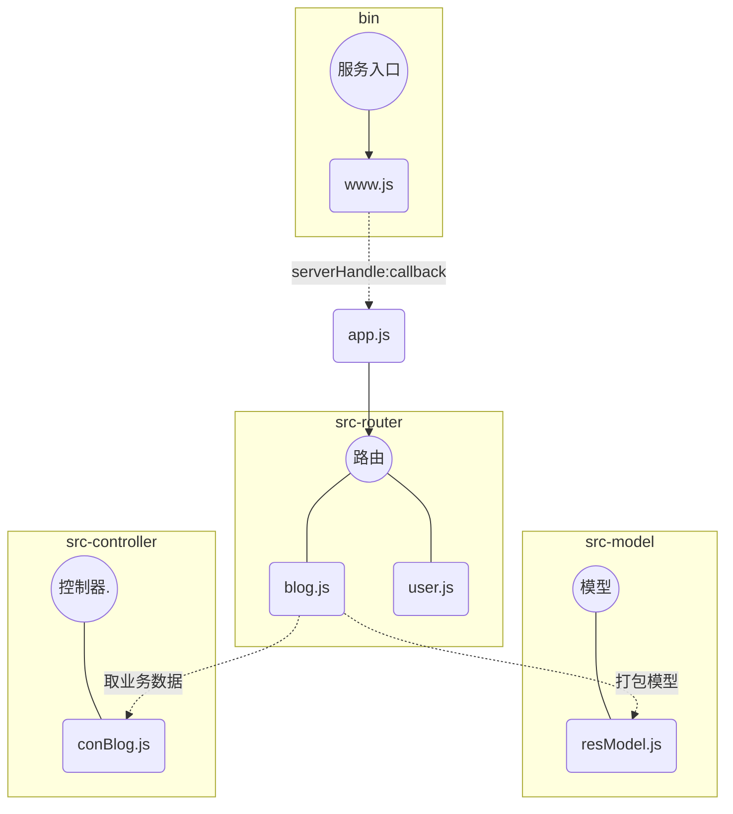
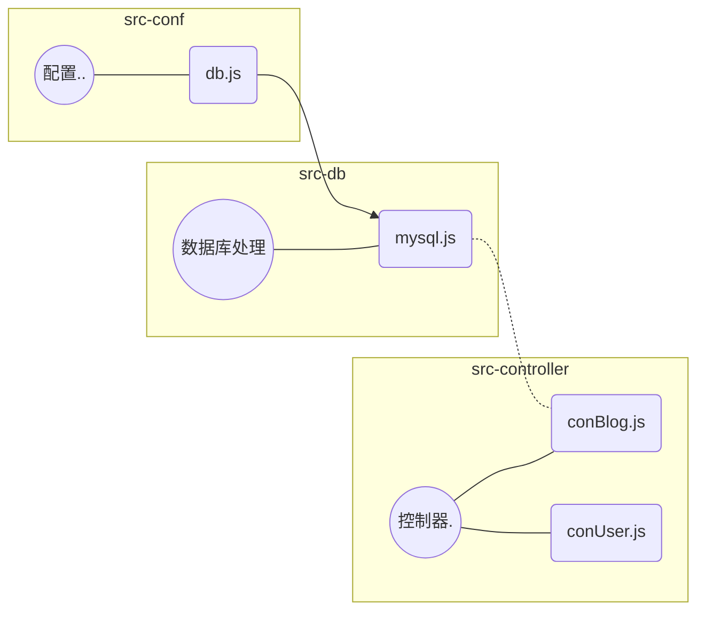

### 1 - 初始化项目

+ `npm init -y` 初始化 node工程
+ 修改 **main** 入口，新建 **bin/www.js**
  + 引入 `http` 模块
  + 创建 `http.createServer` 服务
  + 设置 `server` 端口 `server.listen(PORT)`
+ 根目录创建 **app.js** 为 `server` 的 `callback` 并导入到 **www.js**

### 2 - 安装依赖

+ `cross-env`
+ `nodemon`

在package.json 添加开发环境脚本：

- `"dev": "cross-env NODE_ENV=dev nodemon ./bin/www.js"`
- `nodemon` 监控文件变化不用手动重启 node
- `cross-env` 自动配置环境变量（linux mac win）

配置完成后 npm run dev

> 细节补充
>
> `"prd": "cross-env NODE_ENV=production mp2 ./bin/www.js"`
>
> 线上环境
>
> 如何查看环境  `process.env.NODE_ENV`


### 3 - 初始化路由

#### 创建 blog.js 、 user 等路由

+ 怎么去创建，有哪些步骤
  1. 创建一个 路由函数 接收 `req, res` 的 `fn`
  2. 获取 请求 的 `method`
  3. 获取 url，再接着 `split` 分割出 url 的路由
  4. 对路由做出响应处理

```javascript
const handleBlogRouter = (req, res) => {
    const method = req.method // GET POST
    const url = req.url // 获取完整的url地址
    const path = url.split('?')[0] // 获取路由

    // 获取博客列表
    if (method === 'GET' && path === '/api/blog/list') {
        return {
            msg: '这是获取博客列表的接口'
        }
    }
    
    // 获取博客详情
    if (method === 'GET' && path === '/api/blog/detail') {
        return {
            msg: '这是获取博客详情的接口'
        }
    }

    // ...新建，更新，删除等路由接口
}

module.exports = handleBlogRouter
```


#### 导入路由

+ 导入路由到 server 的 callback 即 app.js

+ 创建 data ，调用路由函数并接收返回值，赋值给该变量

  + 路由处理到数据后 if 是否有数据返回
  + 如果有数据将其处理并 res.end 返回
  + 响应 将 callback return 结束

+ 考虑没命中路由的情况 返回 404

  ```javascript
  // 重新设置返回头
      res.writeHead(404, {'Content-Type': 'text/plain'})
      res.write('404 Not Found\n')
      res.end() 
  ```

  

### 4 - res数据模型

+ 在 **src** 目录下新建  `model`

+ **model** 文件中 创建 `resModel`

+ ```javascript
  class BaseModel {
      constructor(data, message) {
          if (typeof data === 'string') {
              this.message = data
              data = null
              message = null
          }
          if (data) {
              this.data = data
          }
          if (message) {
              this.message = message
          }
      }
  }
  
  class SuccessModel extends BaseModel {
      constructor(data, message) {
          super(data, message)
          this.errno = 0
      }
  }
  
  class ErrorModel extends BaseModel {
      constructor(data, message) {
          super(data, message)
          this.errno = -1
      }
  }
  
  module.exports = {
      SuccessModel,
      ErrorModel
  }
  ```

### 5 - 控制器

+ 在 **src** 目录下新建  `controller`
+ **model** 文件中 创建 `conBlog.js`
  + 创建取数据的方法 如：`getList()`


### 6 - 小结

#### 目前划分层级

+ 第一层 **bin/www.js**
  + 是创建服务的逻辑
  + 生成服务器，设置端口等
+ 第二层 **app.js**
  + 服务基本设置的聚集地
  + 设置返回类型、获取 `path` 解析 `query`
  + 处理路由
  + 处理 **404** 等
+ 第三层 **src/router**
  + 细化处理路由有关
+ 第四层 **src/controller** 和 **src/model**

#### 结构图



### 7 - 封装 POST

+ 在 nodeServer 中，获取 POST 数据，异步陆续截取
+ 封装一个 处理 post 数据的 promise 方法，打包好交给路由

```javascript
const getPostData = req => {
    return new Promise((resolve, reject) => {
        if (req.method !== 'POST') {
            resolve({})
            return
        }
        if (req.headers['content-type'] !== 'application/json') {
            resolve({})
            return
        }
        let postData = ''
        req.on('data', chunk => {
            postData += chunk.toString()
        })
        req.on('end', () => {
            if (!postData) {
                resolve({})
                return
            }
            resolve(
                JSON.parse(postData)
            )
        })
    })
}
```

### 8 - 数据库建表

#### 创建 users 表

+ 表结构 

| id   | title | content | createtime | author |
| ---- | ----- | ------- | ---------- | ------ |
| 1    | 标题  | 内容    | 时间戳     | 张三   |
| 2    | 标题  | 内容    | 时间戳     | 李四   |

+ 设计表结构

| column   | datatype    | pk 主键 | nn 不为空 | AI 自动增加 | default |
| -------- | ----------- | ------- | --------- | ----------- | ------- |
| id       | int         | Y       | Y         | Y           |         |
| username | varchar(20) |         | Y         |             |         |
| password | varchar(20) |         | Y         |             |         |
| realname | varchar(16) |         | Y         |             |         |
| state    | int         |         | Y         |             | 1       |

#### 创建 blogs 表

+ 表结构

| id   | title | content | createtime | author |
| ---- | ----- | ------- | ---------- | ------ |
| 1    | 标题  | 内容    | 时间戳     | 张三   |
| 2    | 标题  | 内容    | 时间戳     | 李四   |

+ 设计表结构

| column     | datatype    | pk 主键 | nn 不为空 | AI 自动增加 | default |
| ---------- | ----------- | ------- | --------- | ----------- | ------- |
| id         | int         | Y       | Y         | Y           |         |
| title      | varchar(50) |         | Y         |             |         |
| content    | longtext    |         | Y         |             |         |
| createtime | bigint(20)  |         | Y         |             |         |
| author     | varchar(20) |         | Y         |             |         |
| state      | int         |         | Y         |             | 1       |

### 9 - 操作表的语句

+ use 库名; // 选择 或 连接 操作的库

#### users 表操作

+ 新建用户

  + insert into users (username, \`password\`, realname) values ('zhangsan','123','张三')

  > \`password\` 是 mysql 关键字 需转化

+ 查询用户

  + select `*` from users; // 查询所有的列
  + select `id, username` from users; // 只查询该表 id 和 username 列
  + \* 业务大时，考虑性能优化 选择列查询
  + select `*` from users where username='zhangsan'; // 单条件查询
  + select `*` from users where username='zhangsan' and ...; // 多条件查询
  + select `*` from users where username='zhangsan' ro ...; // 或查询
  + select `*` from users where username like '%zhangsan%'; // 查找
  + select `*` from users where username='zhangsan' order by id; // 根据排序 倒序加 desc

+ 更新用户

  + updata users set realname='李四' where username='lisi'

    > 注意：如果修改失败，请设置安全模式 SET SQL_SAFE_UPDATES = 0

+ 删除用户

  + delete from users where username= 'lisi' // 以条件删除该表这条数据

    > 注意：仅输入 delete from users 则直接删除表 
    >
    > 真正业务中 数据不是真删除，仅标记状态
    >
    > 删除操作：update users state='0' where id=2;
    >
    > 查询：select \* from users where state=1;
    >
    > 补：mysql 中不等于 运算符 <>

#### blogs 表操作

+ 新建用户
  + insert into blogs (title, content, createtime, author) values ('标题B','内容B',1546870368066,'lisi' );

### 10 - node 工程安装 MySQL 服务及配置

+ 创建配置文件夹 src/conf/

  + 该目录下创建一个数据库的配置文件 `db.js`

    该 db.js 主要是

    1. 获取环境变量，判断环境变量给出 MySQL 对应环境的配置
    2. 将其配置导出

  + 导出给接下来创建的 mysql.js 使用该配置

+ 创建数据库处理文件夹 src/db/

  +  该目录下创建 MySQL 的 处理文件 `mysql.js`

    该 mysql.js ：

    1. npm 安装 MySQL 依赖，并导入依赖
    2. 将 conf 中的 db.js 配置导入
    3. 创建 mysql 连接，封装 sql 处理并返回结果的 fn 将其导出

+ 上述对接到 controller 结构中

  结构如下



> 当前 10 小节 对应该 [ stmpBlog v1.0.1 版本](https://github.com/lailer132/simpBlog/tree/v1.0.1)
>
> 以供于学习及回顾以上知识